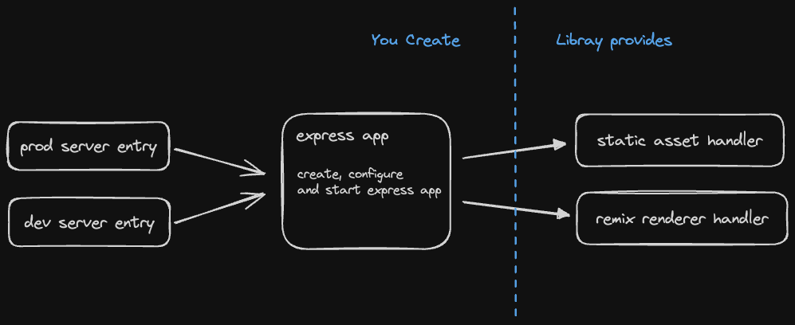

# Remix Express App

✨ Use the same express app in development & production builds.

✨ No additional builds required, fully integrated into the one vite build

✨ Easily start background jobs,

✨ Add additional middleware

✨ Run async tasks before sever starts listening

✨ Listen on a unix socket instead of http port



## Usage

### 1. Create you express app

```ts
// app/.server/app.ts

import { createApp } from '@bad-hacking/remix-express-app/create-app';

import { createRequestHandler } from '@remix-run/express';
import express from 'express';

export default createApp(async (args) => {
  const app = express();

  app.disable('x-powered-by');

  // serve built assets
  args.registerAssetMiddleware(app);

  // non hashed assets like favicon
  app.use(express.static('build/client', { maxAge: '1h' }));

  // handle SSR requests
  app.all('*', createRequestHandler({ build: args.build }));

  const port = process.env.PORT || 3000;

  /*
    Do anything you want here 

    await db.connect()
    await backgroundJobs.start()
  */

  app.listen(port, () =>
    console.log(`Express server listening at http://localhost:${port}`),
  );
});
```

### 2. Create your dev server entry file

```ts
// app/.server/dev-server.js

import { startDevServer } from '@bad-hacking/remix-express-app/dev-server';

startDevServer('app/.server/create-app.ts');
```

### 3. Create your production server entry file

```ts
// app/.server/prod-server.ts

import startApp from './app';
import express from 'express';
import * as build from 'virtual:remix/server-build';

startApp({
  build: build,
  registerAssetMiddleware: (app) => {
    app.use(
      '/assets',
      express.static('build/client/assets', { immutable: true, maxAge: '1y' }),
    );
  },
});
```

### 4. Install vite plugin

```ts
// vite.config.ts

import { vitePlugin as remix } from '@remix-run/dev';
import { remixExpressAppPlugin } from '@bad-hacking/remix-express-app/vite-plugin';
import { defineConfig } from 'vite';

export default defineConfig({
  plugins: [remix(), remixExpressAppPlugin('app/.server/prod-server.ts')],
});
```
